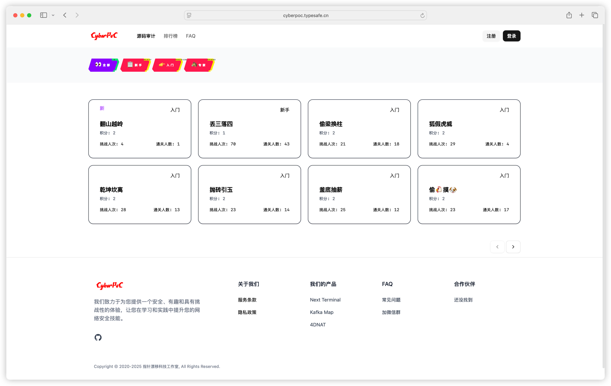
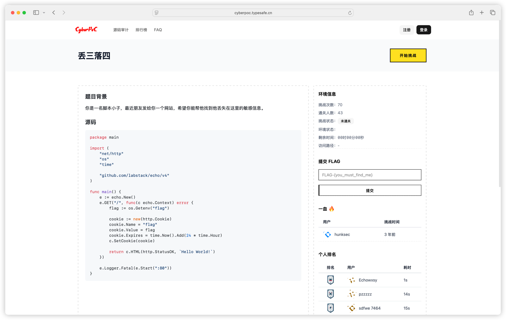
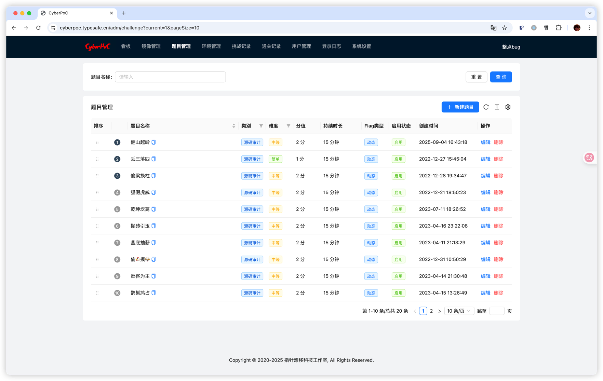

# CyberPoC - 网络安全实验平台

CyberPoC 是一个现代化的网络安全练习和竞赛平台，支持容器化部署的安全挑战，为用户提供实践网络安全技能的环境。

## ✨ 截图




[//]: # (![]&#40;./screenshots/img_2.png&#41;)


## 🚀 快速开始

### 使用 Docker Compose (推荐)

1. **克隆项目**
   ```bash
   git clone https://github.com/dushixiang/cyberpoc.git
   cd cyberpoc
   ```
   
2. **配置应用**
    ```bash
    cp config-example.yaml config.yaml
    ```
   需要手动编辑配置过的 `config.yaml` 文件。

3. **启动服务**
   ```bash
   # 使用 Docker Compose 启动完整服务
   docker compose up -d
   ```

4. **访问应用**
   - http://localhost:8080

5. **初始化数据**
   ```bash
   # 等待服务完全启动后，创建管理员用户
   docker compose exec cyberpoc ./cyberpoc user create -n "管理员" -a "admin@example.com" -t admin
   
   # 导入初始镜像和题目数据（包含21个镜像和18个题目）
   docker compose exec cyberpoc ./cyberpoc init all
   ```

6. **配置反向代理 Caddy（可选）**
   - [caddy](./docs/caddy.md)

## 🎯 初始化系统

### 用户管理

```bash
# 创建管理员用户
docker compose exec cyberpoc ./cyberpoc user create -n "管理员" -a "admin@example.com" -t admin

# 创建普通用户  
docker compose exec cyberpoc ./cyberpoc user create -n "用户" -a "user@example.com" -t regular

# 查看所有用户
docker compose exec cyberpoc ./cyberpoc user list

# 修改用户密码
docker compose exec cyberpoc ./cyberpoc user change-password -i <用户ID>

# 删除用户
docker compose exec cyberpoc ./cyberpoc user delete -i <用户ID>
```

### 数据初始化

```bash
# 导入所有初始数据（镜像+题目）
docker compose exec cyberpoc ./cyberpoc init all

# 仅导入镜像数据
docker compose exec cyberpoc ./cyberpoc init images

# 仅导入题目数据  
docker compose exec cyberpoc ./cyberpoc init challenges
```

初始数据包含：
- **21个Docker镜像** - 各种安全挑战环境
- **18个CTF题目** - 涵盖代码审计、密码学、Web安全等

> **注意**：如果使用预构建的Docker镜像，初始数据已经包含在镜像中。如果你是从源码构建，需要确保`default/`目录被正确复制到容器中。

## ⚙️ 配置说明

直接看 [config-example](./config-example.yaml)

## 🤝 联系我们
- 微信群：加我微信备注「cyberpoc」，拉你进群


## 🤝 贡献

欢迎贡献代码！请遵循以下步骤：

1. Fork 本仓库
2. 创建特性分支 (`git checkout -b feature/AmazingFeature`)
3. 提交更改 (`git commit -m 'Add some AmazingFeature'`)
4. 推送到分支 (`git push origin feature/AmazingFeature`)
5. 打开 Pull Request

## 📄 许可证

本项目采用 MIT 许可证 - 查看 [LICENSE](LICENSE) 文件了解详情。

## 🆘 支持

如果你遇到问题或有建议，请：

- 查看 [Issues](https://github.com/dushixiang/cyberpoc/issues)
- 创建新的 Issue
- 联系维护者

## 🎯 路线图

- [ ] 支持更多挑战类型
- [ ] 增强用户界面
- [ ] 添加团队功能
- [ ] 支持多语言
- [ ] 性能优化
- [ ] 更多部署选项

---

**CyberPOC** - 让网络安全学习更有趣！ 🚀

---

漏洞源代码仓库 https://github.com/dushixiang/vulnerable-code