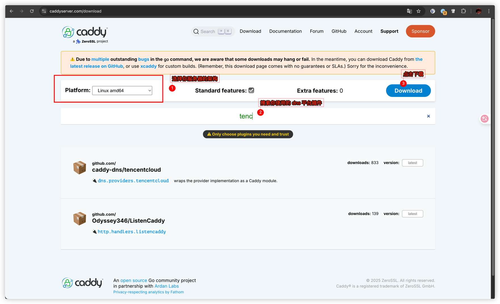

### caddy 配置参考

1. 访问 https://caddyserver.com/download 云编译带有 DNS 插件的 caddy。

    

2. 上传替换你的服务器上的 `/usr/bin/caddy`
3. 配置权限 `chmod +x /usr/bin/caddy`
4. 配置caddy
    
    ```shell
    cyberpoc.typesafe.cn {
        reverse_proxy 127.0.0.1:8080
    }
    
    *.vuln.typesafe.cn {
        reverse_proxy 127.0.0.1:8081
        tls {
            dns tencentcloud {
                 secret_id *******
                 secret_key *******
            }
        }
    }
    ```

   **记得换成你自己的域名**

    - `cyberpoc.typesafe.cn` 一个是平台的访问地址
    - `*.vuln.typesafe.cn` 是统一网关，所有的漏洞题目都通过这个网关访问，caddy 的 DNS 插件需要自己编译才能使用。


5重启 caddy `systemctl restart caddy`